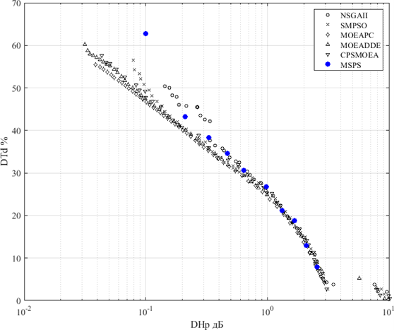
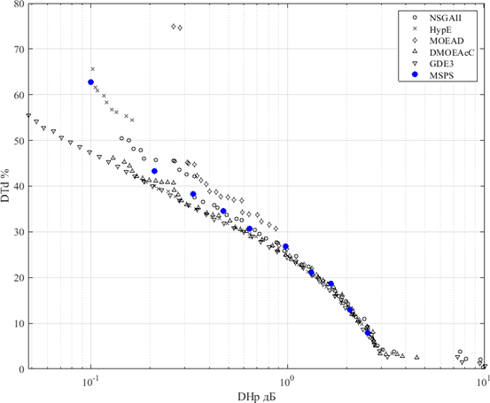
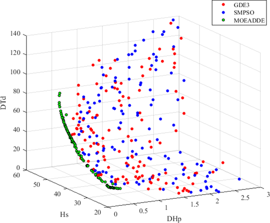
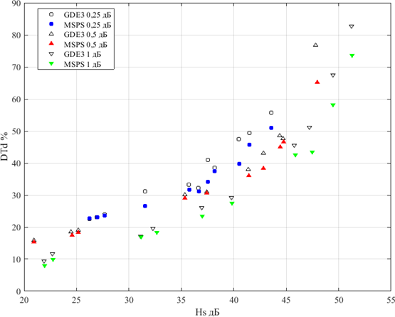

> ***Резюме.*** Применение популяционных алгоритмов, позволяющих одновременно находить много 
элементов  аппроксимации  множества  Парето-оптимальных  решений,  обеспечивает 
значительный  выигрыш  в  затратах  времени  по  сравнению  с  методом  скаляризации  целевой 
функции, дающим одно решение в цикле поиска. В работе исследована возможность применения 
свободно  распространяемого  пакета таких  алгоритмов PlatEMO  для  решения  задач 
многокритериальной оптимизации характеристик электрических фильтров. Установлено, что в 
случае оптимизации одновременно по двум показателям качества из 71 алгоритма, входящего в 
PlatEMO,  только  6  позволили  получить  достаточно  хорошие  результаты.  Найденные  этими 
алгоритмами аппроксимации множества Парето оказались лучше, чем полученные с помощью 
метода скаляризации. Сравнение выполнялось по индикатору Coverage (Покрытие), дающему 
оценку доминируемости элементов одной из аппроксимаций элементами другой.  В случае же 
оптимизации одновременно по трем показателям качества приемлемые результаты дали только 
два  популяционных  алгоритма.  При  этом  найденные  аппроксимации  множества  Парето 
уступают полученным методом скаляризации. Сделан вывод, что рациональный подход к поиску 
аппроксимаций  множеств  Парето-оптимальных  решений в  задачах  с  более  чем  двумя 
показателями  качества может  состоять  в  решении  набора  задач  оптимизации  по двум 
показателям  качества с  применением  одного  из  популяционных  алгоритмов,  при  задании 
ограничений  на  значения  остальных  показателей,  и  последующем  объединении  полученных 
подмножеств. 

> ***Ключевые слова:*** оптимальность по Парето, популяционный алгоритм, скаляризация, декомпозиция, доминирование, амплитудно-частотная характеристика, фазочастотная характеристика.

> ***Для цитирования:*** Смирнов А.В. Применение популяционных алгоритмов в задачах многокритериальной оптимизации характеристик электрических фильтров. *Моделирование, оптимизация и информационные технологии.* 2021;9(3). Доступно по:
[https://moitvivt.ru/ru/journal/pdf?id=1027](https://moitvivt.ru/ru/journal/pdf?id=1027)  DOI: 10.26102/2310-6018/2021.34.3.015

## Введение

Задачей проектирования радиотехнических устройств, как и в других областях техники, является получение характеристик, максимально близких к оптимальным по заданным показателям качества (ПК). При этом, в большинстве случаев, необходима многокритериальная оптимизация, при которой совместно учитываются несколько ПК.

Найти решение, при котором одновременно оптимизируются все ПК, как правило, невозможно, так как улучшение значений одних ПК приводит к ухудшению других @1. В многокритериальных задачах применяется понятие оптимальности по Парето. Решение является Парето-оптимальным, если любое его изменение, дающее улучшение какого-либо ПК, приводит к ухудшению хотя бы одного из остальных ПК @2. Множество Парето-оптимальных решений (ПОР) образует в пространстве значений ПК фронт Парето.

Известны различные способы получения множеств ПОР @2@3@4. Один из вариантов основан на формировании скалярной целевой функции (ЦФ)

$$
F(\mathbf{Q}) = \sum_{k=1}^M W_k Q_k \,,  
$$ {#eq:formula1}

где $\mathbf{Q} = \{ Q_1, \dotsc, Q_M \}$ — вектор ПК, $W_k$ — весовые коэффициенты. Решение $\mathbf{x}^*$
оптимизационной задачи 

$$
\begin{aligned}
    \mathbf{x}^* &= \arg \min_{x \in D} \left( \sum_{k=1}^M W_k Q_k (\mathbf{x}) \right), \\
    W_k &> 0, \quad k = 1, \ \dotsc, M,
\end{aligned}
$$ {#eq:formula2}

где $D$ - пространство поиска, является Парето-оптимальным (@2, Теорема 2.2). Решая задачу @eq:formula2 с разными комбинациями весовых коэффициентов, будем получать различные ПОР. Недостаток данного метода, состоит в отсутствии правил задания весовых коэффициентов, следуя которым можно было бы получить желаемое, например, достаточно равномерное распределение решений в пространстве ПК. 

Развитие этого способа состоит в минимизации одного из ПК при задании 
ограничений на остальные. Известно, что любое ПОР может быть найдено путем 
решения однокритериальной задачи (@2, Теорема 2.7)

$$
\begin{aligned}
    \mathbf{x}^* &= \arg \ \min_{x \in D} \left( Q_k (\mathbf{x}) \right), \\
    \text{где} \ D^{\prime} &= \left\{ \mathbf{x} \in D \mid Q_i (\mathbf{x}) \leq t_i; \ i=1, \ \dotsc, M; \ i \neq k \right\}.
\end{aligned}
$$ {#eq:formula3}

При решении задачи @eq:formula3 задаются ограничения ti на все ПК кроме Qk, который минимизируется. Так как ПК конкурирующие, то минимум будет достигнут при максимально допустимых значениях остальных ПК, то есть, когда эти ПК достигают заданных для них ограничений. Это позволяет получать ПОР, у которых все координаты в пространстве ПК кроме k-й фиксированы на заданных значениях. Так можно обеспечить равномерное или другое желаемое распределение решений в пространстве ПК.

Данный способ применялся в работах @5@6@7@8 для получения множеств ПОР в задачах многокритериальной оптимизации характеристик аналоговых и цифровых фильтров. Однако его применение требует больших затрат времени, так как каждое ПОР приходится искать в отдельном сеансе работы программы.

Существенно повысить эффективность поиска можно, применяя популяционные алгоритмы, в которых используется популяция из $N_{pop}$ решений (точек в пространстве поиска), и в результате эволюции одновременно находятся $N_{pop}$ ПОР @4. В таких методах в каждом поколении осуществляется формирование новых решений (потомков) посредством кроссовера (скрещивания) имеющихся решений (родителей) и мутаций, а затем отбор $N_{pop}$ решений из совокупности родителей и потомков.

Различные	популяционные алгоритмы различаются особенностями формирования потомков и критериями отбора. Среди последних можно выделить отбор по недоминируемости решений и отбор по различным индикаторам, характеризующим равномерность распределения решений и их близость к предполагаемому фронту Парето @4. Еще один тип алгоритмов основан на декомпозиции, которая состоит в формировании $N_{pop}$ подзадач путем приписывания ЦФ вида @eq:formula1 с соответствующей комбинацией весовых коэффициентов каждому решению в популяции и одновременной минимизации всей совокупности этих ЦФ. При отборе лучшего решения каждой подзадачи используется информация о решениях соседних подзадач @9.

В известных публикациях в основном рассматриваются результаты применения таких алгоритмов для решения задач, входящих в наборы тестовых функций для испытаний алгоритмов многокритериальной оптимизации. Примеры применения в практических областях, в частности, в радиотехнике и телекоммуникациях, малочисленны @10. В то же время, ответ на вопрос о применимости популяционных методов многокритериальной оптимизации в конкретных задачах не является очевидным, так как известно, что в разных задачах один и тот же алгоритм ведет себя по-разному @3.

Цель данной работы – исследовать возможности применения популяционных алгоритмов для решения задач многокритериальной оптимизации характеристик электрических фильтров.

## Материалы и методы 

Опишем решаемые задачи оптимизации. Характеристики аналоговых 
электрических фильтров определяются передаточной функцией (ПФн)  

$$
    H(p)= \frac{N(p)}{D(p)},
$$ {#eq:formula4}

где $N(p)$ и $D(p)$ – полиномы комплексной переменной $p$, корни которых являются, 
соответственно, нулями и полюсами ПФн. Из ПФн получаются амплитудно-частотная 
характеристика (АЧХ) 

$$
K(\omega) = |H (j \omega)|
$${#eq:formula5}

и фазочастотная характеристика (ФЧХ)

$$
\varphi(\omega) = \arg(H(j \omega)).
$$ {#eq:formula6}

Эти характеристики оцениваются следующими ПК, определения которых были приведены, в частности, в статьях @6@7: 

- максимальная неравномерность АЧХ в полосе пропускания $DHp$ (дБ);
- минимальное значение затухания в полосе задерживания $Hs$ (дБ);
- максимальное превышение АЧХ над заданным уровнем в полосе перехода между полосами пропускания и задерживания $DHt$ (безразмерное);
- максимальное значение относительной неравномерности частотной характеристики времени задержки, определяемой как производная от ФЧХ по частоте, в полосе пропускания $DTd$ (%).

Показатели $DHp$ и $DTd$ необходимо    минимизировать, показатель $Hs$ максимизировать, а показатель $DHt$ не должен быть больше 0.

В экспериментах применялся свободно распространяемый пакет программ PlatEMO @11, содержащий написанные на языке системы Matlab реализации 71 алгоритма многокритериальной оптимизации и дополнительные программные средства, обеспечивающие возможность использования этих алгоритмов.

Для решения прикладной задачи с помощью PlatEMO необходимо написать в соответствии с достаточно простыми правилами функцию расчета ПК, а также исполняемую программу, вызывающую функцию main(..) из PlatEMO с указанием параметров задачи. В число этих параметров входят размер популяции, размерность пространства поиска, количество совместно оптимизируемых ПК, указатели на используемый алгоритм оптимизации и на функцию расчета ПК, максимальное число вызовов этой функции, режим отображения процесса поиска. Границы области поиска задаются в инициализирующей части функции расчета ПК.

Рассмотрим некоторые особенности применения PlatEMO при решении задачи оптимизации характеристик электрических фильтров.

Во-первых, алгоритмы в PlatEMO нацелены на минимизацию всех ПК, в то время как ПК $ Hs$ надо максимизировать. Поэтому этот ПК берется со знаком «минус».

Во-вторых, допустимы только такие решения, в которых выполнено условие $DHt ≤ 0$. Следовательно, этот ПК должен рассматриваться как ограничение. В задаче оптимизации трех остальных ПК указанное требование реализуется путем введения штрафных слагаемых в их значения

$$
\begin{aligned}
    DHp_1 = DHp + K_1 \cdot DH_t \text{,} \\
    DTd_1 = DTd + K_1 \cdot DH_t \text{,} \\
    Hs_1 = -H_S + K_1 \cdot DH_t \text{.}
\end{aligned}
$$ {#eq:formula7}

Здесь $K_1$ – достаточно большой коэффициент штрафа, например, $K_1 = 1000$.

В-третьих, если использовать приведенные выше ПК, как они определены в @6@7, то диапазоны их значений при найденных решениях окажутся весьма широкими и различающимися. Как показали эксперименты, значения $DHp$ оказываются в интервале от 0,01 до 10 дБ, $Hs$ – от 0 до 200 дБ, $DTd$ – от 0 до 200%. Чтобы привести диапазоны ПК к одному диапазону, приблизительно к интервалу (0, 1), выполняется нормировка

$$
\begin{aligned}
    DHp_2 =& 0.25 \cdot \lg\left(100 \cdot \max (DHp_1; 0.01)\right) \text{,} \\
    Hs_2 =& (200 + Hs_1) / 200 \text{,} \\
    DTd_2 =& DTd_1 / 200 \text{.}
\end{aligned}
$$ {#eq:formula8}

Логарифмическое преобразование в первом из этих соотношений обусловлено тем, что алгоритмы в PlatEMO имеют целью получение равномерного распределения элементов находимого множества решений по аппроксимации фронта Парето в пространстве ПК. При этом большинство найденных решений будет иметь $DHp$ более 1 дБ, в то время как реальный интерес представляют решения со значениями $DHp ≤ 1$ дБ.

Помимо описанной задачи оптимизации по трем ПК исследовалась задача оптимизации по двум ПК, характеризующим полосу пропускания, то есть $DHp$ и $DTd$, в которой ПК Hs фиксируется на заданном значении, отклонение от которого в сторону уменьшения ограничивается еще одним штрафным слагаемым в ПК $DHp$ и $DTd$

$$
\begin{aligned}
    DHp_1 &= DHp + K_1 \cdot DHt + K_2 \max(Hst - Hs, 0) \text{,} \\
    DTd_1 &= DTd + K_1 \cdot DHt + K_2 \max(Hst - Hs, 0) \text{.}
\end{aligned}
$$ {#eq:formula9}

Здесь $Hst$ – заданное (target) значение $Hs$, $K2$ – коэффициент штрафа, например, равный 100. Затем выполняется нормировка $DHp$ и $DTd$ как в @eq:formula8. Операции введения штрафных слагаемых и нормировки могут выполняться и в обратном порядке.

Для сравнения с решениями, даваемыми популяционными алгоритмами из PlatEMO, осуществлялся поиск ПОР путем минимизации скалярной ЦФ в соответствии с @eq:formula3. При этом в каждом сеансе поиска ограничения задаются на ПК $DHp$, $Hs$ и $DHt$, а $DTd$ минимизируется. Метод, реализованный, в частности, в программе SOFTD @6, основан на многократном решении (multistart) задачи @eq:formula3 с применением алгоритма покоординатного спуска типа Pattern Search @2@3. Выбор стартовой точки каждого цикла локального поиска производится с заданными вероятностями в окрестности конечной точки предыдущего цикла, или в окрестности наилучшей из ранее найденных точек, или в случайной новой точке. Такой эвристический алгоритм обеспечивает как детальное обследование перспективных областей, так и разведку в новых областях.

Необходимо иметь в виду, что множество решений, находимых тем или иным методом, является только аппроксимацией истинного множества ПОР. Во-первых, найденное множество содержит конечное число решений, в то время как множество ПОР задачи многокритериальной оптимизации с ПК, выражаемыми непрерывными функциями, является бесконечным. Во-вторых, найденные решения могут и не быть ПОР в силу ограниченных возможностей реальных алгоритмов поиска экстремумов.

Для оценки качества аппроксимации множества ПОР применяют различные индикаторы, определения и алгоритмы вычисления которых приведены в @11@12. Многие из них основаны на сравнении найденной аппроксимации с выборкой из истинного множества ПОР. Такие индикаторы в нашем случае не годятся, так как это множество для рассматриваемых задач не известно. Для сравнения аппроксимаций множеств ПОР, находимых разными методами, был использован индикатор Coverage (Покрытие), определяемый как доля решений из аппроксимации $A1$, которые слабо доминируются хотя бы одним решением из аппроксимации $A2$, что записывается следующим образом

$$
\begin{aligned}
   I_C(A_1, A_2) = \frac {\mathbf{Q}_k \in A_1 , | \mathbf{Q}_j \in A_2 : \mathbf{Q}_j \preceq \mathbf{Q}_k|}{|A_1|}
   \text{.}
\end{aligned}
$$ {#eq:formula10}

Здесь $|S|$ - количество элементов в множестве $S$, $\mathbf{Q}_i$ – решение в пространстве ПК, то есть вектор значений ПК данного решения. Отношение слабого доминирования $\mathbf{Q}_j  \preceq \mathbf{Q}_k$ означает, что решение $\mathbf{Q}_j$ не хуже решения $\mathbf{Q}_k$, то есть для значений ПК этих решений выполняются неравенства $Q_{ji} \leq Q_{ki}, i = 1, \dots, M$. Чем больше значение Coverage, тем лучше аппроксимация $A2$ по сравнению с аппроксимацией $A1$.
Еще один использовавшийся индикатор качества аппроксимаций множества ПОР, называемый Spacing или Среднее рассеяние, характеризует равномерность распределения в пространстве ПК решений, входящих в данную аппроксимацию, и определяется как среднеквадратическое отклонение распределения минимальных расстояний в пространстве ПК между решения, входящими в аппроксимацию,

$$
I_S(A) = \sqrt{\frac{1}{|A|-1} \sum_{j=1}^{|A|} (\overline{d} - d_j)^2} \text{.}
$$ {#eq:formula11}

Расстояния измеряются в манхеттеновской метрике, то есть как сумма расстояний
по каждой координате. В @eq:formula11 использованы обозначения

$$
d_j = \min_{k \in [1\dots|A|],k \neq j} \| \mathbf{Q}_j, \mathbf{Q}_k \|_{M} \text{,} \ \overline{d} = mean(d_k), k \in [1 \dots |A|] \text{.} 
$$

## Результаты

Начнем с результатов оптимизации $DHp$ и $DTd$ при фиксации $Hs$. Исследование было выполнено для ФНЧ различных порядков и с разными целевыми значениями $Hst$. В качестве примера приведем результаты для ФНЧ 6-го порядка при $Hst =$ 40 дБ.

Эксперименты показали, что из 71 алгоритма в составе PlatEMO 11 оказались неработоспособными применительно к решаемой задаче, 24 показали неудовлетворительные результаты (фронт Парето с большими разрывами, плохие значения ПК решений), 6 показали хорошие результаты (непрерывный фронт Парето в широком диапазоне значений $DHp$ и $DTd$), а остальные 30 - удовлетворительные результаты.

В группу с оценкой «хорошо» вошли следующие алгоритмы. 

CPSMOEA (Classification and Pareto Domination based Multiobjective Evolutionary). Алгоритм формирования новых решений – DE (Differential Evolution). Отбор по недоминируемости.

GDE3 (The third Evolution Step of Generalized Differential Evolution). Формирование новых решений – DE. Отбор по недоминируемости.

SMPSO (New PSO-based Metaheuristic for Multi-objective Optimization). Формирование новых решений по правилам PSO (Particle Swarm Optimization). Отбор по недоминируемости.

DMOEAeC (Decomposition-Based Multi-objective Evolutionary Algorithm with the ЕConstraint Framework). Алгоритм формирования новых решений – генетический. Отбор по методу декомпозиции.

MOEADDE (Multiobjective Optimization Problems With Complicated Pareto Sets). Алгоритм формирования новых решений – DE. Отбор по методу декомпозиции.

MOEAPC (Multiobjective Evolutionary Algorithm Based on Polar Coordinates). Алгоритм формирования новых решений – DE. Отбор по недоминируемости.

Из группы с оценкой «удовлетворительно» далее будут рассматриваться результаты двух широко известных алгоритмов, являющихся основой для новых разработок, соответственно, с отбором по недоминируемости и с применением
декомпозиции.

NSGAII (Non-dominated Sorting Genetic Algorithm II). Алгоритм формирования новых решений – генетический. Отбор по недоминируемости.

MOEAD (Multiobjective Evolutionary Algorithm Based on Decomposition). Алгоритм формирования новых решений – генетический. Отбор по методу
декомпозиции.

Для сравнения был выбран один алгоритм с отбором по индикатору качества аппроксимации множества ПОР, также показавший удовлетворительные результаты.

HypE (Algorithm for Fast Hypervolume-Based Many-Objective Optimization). Алгоритм формирования новых решений – генетический. Отбор по индикатору Hypervolume.

Аппроксимации фронтов Парето решаемой задачи, полученные с помощью перечисленных алгоритмов, приведены на Рисунке @fig:pic1 и Рисунке @fig:pic2. Для всех алгоритмов задавались размер популяции $N_{pop} = 50$ и количество вычислений вектора из двух ПК $N_{ev} = 2·10^5$. Данные разделены на два графика, чтобы обеспечить их различимость. При этом на обоих графиках приведены результаты метода NSGAII в качестве ориентира для сравнения остальных алгоритмов. При расчете индикаторов значения всех ПК нормировались к их максимальным значениям. Кроме того, были отброшены все решения с $DHp > 3$ дБ, которые явно выпадают из аппроксимаций фронта Парето.

Также на обоих графиках показаны несколько решений, найденных методом скалярной ЦФ с помощью программы SOFTD. Эти решения помечены как MSPS (Multistart Pattern Search). Задавалось количество стартов алгоритма $N_{start} = 5000$. Как показали эксперименты, такое большое число необходимо для получения наилучшего результата с достаточно высокой вероятностью.

{#fig:pic1}

Результаты сравнения по индикатору Coverage даны в Таблице @tbl:tab1. В заголовках столбцов цифры соответствуют названиям алгоритмов в заголовков строк с такими же номерами. В ячейках таблицы приведены значения Ic(A1,A2), определяемые соотношением (10), где A1 – аппроксимация множества ПОР, найденная методом, название которого в заголовке столбца, а A2 – аппроксимация, найденная методом, название которого в заголовке строки. Как уже указывалось, значение индикатора Coverage показывает долю решений из A1, которые слабо доминируются хотя бы одним решением из A2. Единицы в ячейках на главной диагонали показывают, что все решения аппроксимации слабо доминируются решениями этой же аппроксимации, так как значения ПК каждого из них равны сами себе.

В последней строке Таблицы @tbl:tab1 значение $S_1$ равно сумме всех ячеек данного столбца, за исключением ячейки на главной диагонали. Эта сумма дает оценку доминируемости решений данного метода решениями других методов. Чем лучше алгоритм по сравнению с другими, тем меньше значение $S_1. В последнем столбце значение $S_2$ равно сумме всех ячеек данной строки без ячейки на главной диагонали. Эта сумма показывает, насколько решения данного алгоритма доминируют над решениями, даваемыми другими методами, и она оказывается больше для лучших алгоритмов. Лучшие значения $S_1$ и $S_2$ выделены жирным шрифтом.

{#fig:pic2}

: Значения Coverage для задачи оптимизации по ПК $DHp$ и $DTd$ {#tbl:tab1} 

| | A2 / A1 | 1     | 2     | 3     | 4     | 5     | 6     | 7     | 8     | 9     | S2    |
|-|-------|----|----|----|----|----|----|----|----|----|----|
|1| NSGAII | 1,000 | 0,149 | 0,000 | 0,021 | 0,111 | 0,042 | 0,578 | 0,065 | 0,000 | 0,966 |
|2| SMPSO  | 0,628 | 1,000 | 0,000 | 0,000 | 0,133 | 0,208 | 0,578 | 0,239 | 0,000 | 1,786 |
|3| MOEAPC | 0,767 | 0,723 | 1,000 | 0,574 | 0,689 | 0,354 | 0,689 | 0,543 | 0,222 | 4,563 |
|4| MOEADDE | 0,605 | 0,468 | 0,000 | 1,000 | 0,511 | 0,229 | 0,644 | 0,413 | 0,000 | 2,871 |
|5| CPSMOEA | 0,581 | 0,426 | 0,000 | 0,021 | 1,000 | 0,188 | 0,600 | 0,283 | 0,000 | 2,098 |
|6| HypE   | 0,628 | 0,511 | 0,040 | 0,170 | 0,400 | 1,000 | 0,756 | 0,478 | 0,022 | 3,005 |
|7| MOEAD  | 0,070 | 0,149 | 0,000 | 0,021 | 0,044 | 0,000 | 1,000 | 0,065 | 0,000 | 0,350 |
|8| DMOEAeC | 0,721 | 0,340 | 0,000 | 0,064 | 0,289 | 0,125 | 0,667 | 1,000 | 0,000 | 2,206 |
|9| GDE3   | 0,814 | 0,809 | 0,020 | 0,340 | 0,644 | 0,417 | 0,800 | 0,609 | 1,000 | 4,453 |
| | S1     | 4,814 | 3,574 | 0,060 | 1,213 | 2,822 | 1,563 | 5,311 | 2,696 | 0,244 |       |

Результаты сравнения алгоритмов по другим индикаторам приведены в Таблице @tbl:tab2. Лучшее значение по каждому индикатору выделено жирным шрифтом. 

Как пояснялось выше, индикатор Spacing характеризует равномерность распределения решений по фронту Парето. Индикатор Spacing_log рассчитывался по тем же правилам (11), но с заменой $DHp$ на lg($DHp$), чтобы характеризовать равномерность расстояний между решениями в аппроксимации фронта Парето при логарифмической шкале $DHp$, как на Рисунках @fig:pic1 и @fig:pic2.

Еще один показатель, специфический для решаемой задачи оптимизации – Min_$DHp$, минимальное значение $DHp$, достигнутое в аппроксимации множества ПОР.

В последнем столбце приведены значения времени выполнения поиска. Также отметим, что просто выполнение 2·105 раз функции расчета вектора ПК на том же компьютере занимает около 35 с, а время выполнения 5000 циклов локального поиска программой SOFTD, написанной на C++, равно примерно 150 с.

: Значения индикаторов для задачи оптимизации по ПК $DHp$ и $DTd$ {#tbl:tab2} 

|       | Алгоритм | Spacing | Spacing_log | Min_DHp, дБ | Time, с |
|-|---|--|--|--|--|
| 1     | NSGAII  | 0,0214  | 0,0326      | 0,143       | 45      |
| 2     | SMPSO   | 0,0167  | 0,0253      | 0,0804      | 50      |
| 3     | MOEAPC  | 0,0396  | 0,0374      | 0,0419      | 231     |
| 4     | MOEADDE | 0,0356  | 0,0330      | 0,0331      | 105     |
| 5     | CPSMOEA | 0,0189  | 0,0504      | 0,0434      | 62      |
| 6     | HypE    | 0,0177  | 0,0187      | 0,105       | 66      |
| 7     | MOEAD   | 0,0195  | 0,0308      | 0,263       | 148     |
| 8     | DMOEAeC | 0,0206  | 0,0225      | 0,148       | 178     |
| 9     | GDE3    | 0,0210  | 0,0149      | 0,0527      | 46      |

Перейдем к задаче оптимизации по трем ПК $DHp$, $Hs$ и $DTd$ характеристик ФНЧ 6-го порядка. Из всех алгоритмов удовлетворительные результаты показали только GDE3 и SMPSO. Графики аппроксимаций фронтов Парето при размере популяции $N_{pop} = 200$ и количестве вычислений вектора ПК Nev = 106 приведены на Рисунке @fig:pic3. Учтены только решения с $Hs ≥ 20$ дБ и $DHp ≤ 3$ дБ.

Другие алгоритмы не смогли найти аппроксимацию множества ПОР, обеспечивающую получение фронта Парето в пространстве трех ПК с более-менее равномерным распределением точек в достаточно большой области этого пространства. Пример неудовлетворительного результата, полученного с применением алгоритма MOEADDE, также показан на Рисунке @fig:pic3. Один из лучших в задаче с двумя ПК алгоритм MOEAPC для задачи с тремя ПК оказался не пригоден, так как переход к полярным координатам возможен только в двумерной задаче.

В Таблице @tbl:tab3 даны результаты сравнения алгоритмов по индикатору Coverage. Для обоих алгоритмов представлены случаи с $N_{pop} = 200$ и $N_{pop} = 500$ при сохранении полного количества вычислений вектора ПК $Nev = 106$. Таким образом, при увеличении размера популяции уменьшается число поколений эволюции. Суммы $S_1$ и $S_2$ имеют тот же смысл, что и в Таблице @tbl:tab1. Результаты сравнения по другим индикаторам даны в Таблице @tbl:tab4. Лучшие результаты выделены жирным шрифтом.

Наконец, сравним результаты работы популяционных алгоритмов и метода скаляризации ЦФ, реализуемого как многократный запуск локального поиска экстремума (MSPS). Сделать однозначный вывод о преимуществе одного из подходов над другим по 3D графикам типа Рисунка @fig:pic3 невозможно. Для получения более наглядного представления используем 2D графики, на которых отобразим срезы 3D графика в плоскостях с заданными значениями одного из ПК

На Рисунке @fig:pic4 показаны такие графики, полученные при значениях $DHp$ 0,25; 0,5 и 1,0 дБ с отклонениями от этих значений не более 0,03; 0,05 и 0,04 дБ, соответственно. Как пример популяционного алгоритма взят GDE3 с $N_{pop} = 500$. При поиске каждого решения задачи (3) показатели $DHp$ и $Hs$ фиксировались на значениях из одного из решений, найденных GDE3. Количество стартов MSPS задавалось равным 5000.

{#fig:pic3}

: Значения Coverage для задачи оптимизации по ПК $DHp$, $Hs$ и $DTd$ {#tbl:tab3} 

| A1 \ A2      | GDE3-200 | GDE3-500 | SMPSO-200 | SMPSO-500 | S2    |
|--------------|----------|----------|-----------|-----------|-------|
| GDE3-200     | 1        | 0,0334   | 0,2143    | 0,0237    | 0,271 |
| GDE3-500     | 0,264    | 1        | 0,5       | 0,143     | 0,907 |
| SMPSO-200    | 0,024    | 0,0139   | 1         | 0,0053    | 0,0432|
| SMPSO-500    | 0,24     | 0,170    | 0,5       | 1         | 0,910 |
| S1           | 0,528    | 0,217    | 1,21      | 0,172     |       |

: Значения индикаторов для задачи оптимизации по ПК $DHp$, $Hs$ и $DTd$ {#tbl:tab4} 

|              | GDE3-200 | GDE3-500 | SMPSO-200 | SMPSO-500 |
|--------------|----------|----------|-----------|-----------|
| Spacing      | 0,0364   | 0,0254   | 0,0370    | 0,0222    |
| Spacing log  | 0,0813   | 0,0523   | 0,154     | 0,0474    |
| Time, с      | 203      | 207      | 222       | 218       |

{#fig:pic4}

## Обсуждение 

Из визуального анализа графиков на Рисунках @fig:pic1 и @fig:pic2 можно сделать вывод, что при $DHp > 0,5$ дБ все методы дают примерно одинаковые результаты, а вот при $DHp ≤ 0,5$ дБ наблюдаются различия, на основании которых и было сделано разделение на группы с оценками «хорошо» и «удовлетворительно». Кроме того, что важно с точки зрения цели данной работы, при $DHp ≤ 0,5$ дБ популяционные алгоритмы из группы с оценкой «хорошо» находят решения, которые лучше по обоим ПК, чем решения, находимые методом скаляризации, то есть доминируют над последними. Далее, можно предположить, что из популяционных алгоритмов наилучшие результаты показывают MOEAPC и GDE3. Но для более объективного заключения необходимо количественное сравнение по индикаторам качества аппроксимация множества ПОР.

Данные в Таблице @tbl:tab1 подтверждают сделанный на основе графиков вывод, что наилучшие аппроксимации множеств ПОР для решаемой задачи дают алгоритмы MOEAPC и GDE3, значения $S_1$ и $S_2$ которых заметно лучше, чем у других методов, и близки между собой. То есть решения, даваемые этими двумя алгоритмами, в большинстве случаев доминируют над решениями, находимыми другими алгоритмами.

И по другим индикаторам алгоритмы MOEAPC и GDE3 оказываются в числе лидеров. Так по индикатору Spacing log лучшим оказался алгоритм GDE3. По индикатору Min_$DHp$ алгоритмы MOEAPC и GDE3 показали достаточно близкие результаты, немного уступающие лучшему по этому индикатору алгоритму MOEADDE. По продолжительности поиска GDE3 оказался на втором месте, лишь немного уступив победителю NSGAII. А вот затраты времени алгоритма MOEAPC оказались почти на порядок больше. Возможно, это связано с большим объемом вычислений при переходе к полярной системе координат.

Следует отметить, что в разных популяционных алгоритмах поиска затраты времени, связанные с самим алгоритмом, а не с вычислением ПК, существенно различаются и могут составлять существенно больше половины всех затрат времени. Однако все они дают значительный выигрыш во времени по сравнению с методом скаляризации ЦФ, который затрачивает на поиск одного решения в 3 раза больше времени, чем алгоритм GDE на поиск 50 решений, причем качество решений последнего оказывается более высоким.

Анализируя данные в Таблице @tbl:tab3, можно заметить, что аппроксимации множества ПОР при $N_{pop} = 500$ лучше аппроксимаций при $N_{pop} = 200$ независимо от сравниваемых алгоритмов. При одинаковых размерах популяций SMPSO имеет преимущество над GDE3, но не очень значительное. Результаты сравнения по индикаторам Spacing и Spacing log, приведенные в Таблице @tbl:tab4, также показывают значительное преимущество аппроксимаций, полученных при $N_{pop} = 500$, и небольшой выигрыш SMPSO у GDE3 при этом размере популяции. При этом затраты времени на выполнение поиска во всех случаях близкие по величине.

Как видно из графиков на Рисунке @fig:pic4, в данном случае MSPS имеет преимущество над популяционным алгоритмом. При небольших значениях $Hs$ (менее 35 дБ) оба метода показывают близкие результаты. Но при дальнейшем увеличении $Hs$ различие получаемых значений $DTd$ становится все более заметным. Следует отметить, что поскольку каждое решение, полученное методом MSPS, имеет значения двух ПК ($DHp$ и $Hs$) приблизительно равные значениям этих ПК для одного из решений, полученных популяционным алгоритмом, то применение индикатора Coverage здесь не имеет смысла. Достаточно сравнить по третьему ПК $DTd$.

Интересно отметить, что во всех случаях преимущество оказавшегося лучше метода увеличивается при повышении требований к характеристикам фильтра. В случае двух ПК – при уменьшении значения $DHp$, то есть уменьшении неравномерности АЧХ в полосе пропускания, а в случае трех ПК – при увеличении значения $Hs$, то есть увеличении минимального затухания в полосе задерживания. По-видимому, эти факты связаны с особенностями рельефов ЦФ и механизмов работы алгоритмов. Однако эти вопросы еще мало исследованы.

## Заключение

Выполненное исследование показывает, что некоторые из популяционных алгоритмов, представленных в пакете PlaEMO, позволяют решать задачу оптимизации характеристик электрических фильтров по двум ПК и получать лучшую аппроксимация множества ПОР, чем метод скаляризации, и притом со значительным выигрышем по затратам времени. В то же время, в случае оптимизации по трем ПК аппроксимации, находимые популяционными алгоритмами оказались хуже при сохранении большого выигрыша по времени.

Можно предположить, что рациональный подход к поиску аппроксимаций множеств ПОР в задачах с более чем двумя ПК может состоять в решении набора задач с двумя ПК с применением одного из популяционных алгоритмов, при фиксации значений остальных ПК, и последующем объединении полученных подмножеств. При этом можно ожидать достаточно хорошего качества находимых аппроксимаций при значительно меньших затратах времени по сравнению с поиском каждого отдельного решения методом полной скаляризации ЦФ.

Вопрос о применимости и целесообразности такого подхода следует рассматривать применительно к конкретным задачам. Для получения более общих рекомендаций необходимо изучение влияния свойств функций, определяющих значения ПК, на работу различных алгоритмов поиска оптимальных решений.

## ЛИТЕРАТУРА